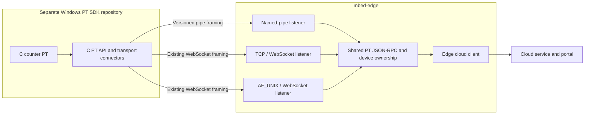

# Windows PT transport research

Research date: October 3, 2026. Repository baseline: `9a0985a`.

Keep the existing loopback TCP/WebSocket listener and add optional native
AF_UNIX and named-pipe listeners. AF_UNIX is now implemented and passed Debug
and Release PT-to-cloud counter reads on this Windows 10 host. Named pipes
now have a native Edge Core adapter behind `EDGE_WINDOWS_NAMED_PIPE` (default
ON for Windows), with runtime activation through `pt.namedPipe.enabled`.
The runtime `pt.tcpEnabled` setting can disable the TCP/WebSocket listener
while keeping either or both IPC listeners available. See the
[implemented pipe contract and C test client](../test/windows-core/NAMED-PIPE-PT.md).

## Comparison and recommendation

| Transport | PT framing | Recommended implementation | Remaining work |
| --- | --- | --- | --- |
| Existing TCP | HTTP upgrade, WebSocket, JSON-RPC | Retain `127.0.0.1:7681` and `--edge-pt-address` | Broader Windows target qualification |
| Winsock AF_UNIX | Same WebSocket and JSON-RPC | Implemented native listener adopting accepted sockets into existing libwebsockets | Restricted-service ACL, broader Windows target and load qualification |
| Windows named pipe | Existing PT JSON-RPC inside versioned length-prefixed records | Implemented native overlapped I/O feeding the shared RPC layer | Real service-SID deployment, cloud operations, load and broader OS qualification; supported SDK deferred |

Implement AF_UNIX first. The socket-adoption experiment demonstrates that the
existing WebSocket implementation can serve an AF_UNIX connection without
enabling its built-in Unix listener. Implement named pipes through a separate
adapter with the documented version-1 framing contract. Support all enabled
listeners concurrently; retain TCP as the default. Do not silently switch a
client to another transport after an access or connection failure.

The AF_UNIX implementation now uses a JSON runtime settings file selected by
`--config`, rather than the originally proposed socket-path CLI option. See
[the native C PT and runtime configuration instructions](../test/windows-core/AF-UNIX-PT.md).
The counter test verified 3001 → 3002 → 3003 in Debug and 4001 → 4002 → 4003
in Release through the portal and matching cloud GET/CONTENT traces. TCP PTs
also registered, wrote and unregistered while each AF_UNIX PT remained
connected. All test PTs and temporary Edge instances closed cleanly. These
cloud reads do not qualify unsolicited notifications or subscriptions.
Named-pipe framing and runtime settings are documented in the implemented guide
above. The separate Windows PT SDK remains on the backlog.

Use a separate IPC directory, rather than allowing PT users into directories
holding cloud credentials. Separate names/paths should support multiple Edge
instances. Existing Linux socket defaults and Windows TCP invocations should
keep their current behavior. New listener startup failures should be explicit.

## AF_UNIX findings

Windows provides native AF_UNIX stream sockets through Winsock. The public
SDK header is `afunix.h`. Microsoft describes pathname access controls and
socket-file removal with `DeleteFile`; its introduction also identifies
differences from Linux ancillary-data and socketpair support.
Use pathname stream sockets for the initial implementation and probe support
at runtime. Do not promise Linux abstract-namespace or WSL interoperability
without separate testing. [Microsoft AF_UNIX introduction](https://devblogs.microsoft.com/commandline/af_unix-comes-to-windows/)

The installed SDK defines a 108-byte `sun_path` field. Validate the encoded
path, including its terminating NUL, before binding; reject oversized paths.
Test spaces and Unicode. The probe successfully removed its socket file after
closing both endpoints. Production code needs exclusive ownership, stale-file
recovery and cleanup that cannot unlink another live listener. The existing
Windows `edge_io_acquire_lock_for_socket` implementation is a possible basis.

The bundled library is libwebsockets 3.1.0. Both the Edge wrapper and its own
CMake disable Unix sockets on Windows. Turning the flag on would also expose
Unix-oriented headers, `unlink`/`chown` cleanup and socket-option assumptions.
The Windows socket-option function currently ignores its `unix_skt` argument.

There are two viable server approaches:

1. **Preferred:** accept AF_UNIX connections using Winsock on the Edge event
   thread, make them nonblocking, then call `lws_adopt_socket` (or its explicit-vhost variant). The
   existing library handles HTTP upgrade, masking, fragmentation, writable
   callbacks and JSON-RPC delivery. A local prototype passed this path with
   the current, unchanged static library. No internal TCP relay is involved.
2. Enable and port the library's Unix listener/client implementation. This
   would allow reuse of its Unix endpoint configuration, but requires more
   third-party changes and careful Windows guards. Consider it if a native
   libwebsockets PT client is a requirement.

Winsock documents a single-provider restriction for sockets in a `select`
set. The probe reported distinct AF_UNIX and TCP provider IDs but successfully
handled both together on this host, including through the bundled libevent
`win32` backend. This is useful empirical evidence, not a portability guarantee.
Repeat mixed-listener tests on every supported Windows target and with the
real HTTP/cloud/event-loop workload. If a target fails, use a separate readiness
mechanism and marshal work to the Edge thread.
[Winsock select documentation](https://learn.microsoft.com/en-us/windows/win32/api/winsock2/nf-winsock2-select)

Protect the socket directory and socket with explicit ACLs granting the actual
restricted Edge service token the required rights and allowing only intended
PT identities to connect. Validate these permissions under LocalService with
the service SID; tests under the interactive account are insufficient.

## Named-pipe findings

Named pipes use Windows `HANDLE` I/O, rather than Winsock socket operations.
Use `CreateNamedPipeW`, duplex byte mode, `FILE_FLAG_OVERLAPPED` and
`PIPE_REJECT_REMOTE_CLIENTS`. Maintain multiple instances for concurrent PTs.
Use `FILE_FLAG_FIRST_PIPE_INSTANCE` on the initial instance to detect an
existing owner; later instances must not use that flag. Asynchronous operation
should use overlapped I/O rather than `PIPE_NOWAIT`.
[CreateNamedPipe documentation](https://learn.microsoft.com/en-us/windows/win32/api/winbase/nf-winbase-createnamedpipea)

The library's `windows-pipe.c` only supports its internal cancellation wakeup;
it is not a PT pipe listener. The current libevent watcher and libwebsockets
transport expect socket readiness and socket send/receive operations. Casting
a pipe handle to a socket will not provide a working transport.

For a native adapter, keep each connection's read/write state asynchronous and
marshal completed messages to the Edge event thread. A bounded worker using
overlapped events is a reasonable initial design; IOCP is another option for
larger connection counts. Avoid a wholesale event-loop migration solely for
this feature. Separate read and write operations need separate state and
buffers. Shutdown must cancel pending operations and wait for completion before
releasing their memory. Microsoft documents that `CancelIoEx` itself does not
wait for cancellation completion.
[Overlapped pipe example](https://learn.microsoft.com/en-us/windows/win32/ipc/named-pipe-server-using-overlapped-i-o),
[CancelIoEx](https://learn.microsoft.com/en-us/windows/win32/api/ioapiset/nf-ioapiset-cancelioex)

The shared RPC layer accepts a write callback. The server communication layer
now uses transport close/destroy callbacks and the connection's write function
for incoming-message responses. Resource registration, method dispatch,
ownership and cloud behavior remain common to all transports.

Recommended pipe framing is one bounded UTF-8 JSON-RPC document per explicit
length-prefixed record, with a versioned connection contract. Specify length
encoding, a maximum frame size and startup validation before implementation.
Handle partial headers, partial bodies and several records in one read. Byte
mode makes client integration simpler; it provides no implicit message
boundaries. JSON-RPC alone does not define a stream's record boundaries.

If identical WebSocket framing on all transports is required, alternatives are
a pipe-to-socket stream relay, or a substantial WebSocket I/O backend adaptation.
A relay preserves the existing server parser but introduces an internal
connection per PT, two queues and additional disconnect/lifecycle handling.
It can be a compatibility prototype; the native JSON-RPC adapter is my preferred
long-term pipe design. It requires clients that understand the pipe framing.

Use an explicit DACL, with permissions for the service and the configured PT
identities. Default pipe security is unsuitable as a production policy.
Microsoft warns that generic write permissions can also allow creation of
server pipe instances; grant the specific required client rights instead.
Do not impersonate a PT merely to process its resource messages.
[Named-pipe access rights](https://learn.microsoft.com/en-us/windows/win32/ipc/named-pipe-security-and-access-rights)

## Named-pipe implementation review

Named pipes are feasible for the Windows versions this repository targets.
The existing local probe exchanged bytes in both directions using an overlapped
duplex pipe. It did not run the PT RPC protocol, register a cloud resource or
qualify the installed restricted LocalService identity. Its restricted-execution
run received access denied; the ordinary-token run passed. That result does
not establish the exact cause of a failure under the real service identity.

The main integration work is in the transport boundary. The existing
`transport_connection_t` already has an opaque transport pointer and a write
callback, and outbound PT requests generally use that callback. However,
`srv_comm.c` originally assumed a WebSocket for close, destroy and incoming-message
responses. The implementation extends those operations and routes received
records through `rpc_handle_message` with the connection's write callback.
The callback takes ownership of serialized data, so a queued pipe
write must retain the buffer until I/O completes and release it on failure.
Preserve existing PT registration, device ownership, pending-RPC cancellation
and cloud behavior. Start with a PT-only pipe; the WebSocket URL currently
selects PT, management or GRM, and a raw pipe has no such URL routing.

| Approach | Compatibility | Main cost |
| --- | --- | --- |
| Native pipe carrying framed JSON-RPC | Reuses PT methods and resource encoding; clients need a pipe connector and framing | Transport lifecycle abstraction and native asynchronous I/O |
| Native pipe carrying HTTP/WebSocket | Preserves the existing wire framing; clients still need a pipe connector | A substantial I/O adaptation to the bundled socket-oriented WebSocket library |
| Pipe-to-socket relay | Can reuse the current WebSocket parser | Internal socket per client, two-way queues and an additional ownership/disconnect boundary |

The native framed-JSON-RPC adapter is now implemented. Production service,
larger-workload and additional-OS qualification remain separate from the C
fixture results.
For its contract, use duplex byte mode and explicit bounded records, such as a
four-byte unsigned big-endian byte count followed by one UTF-8 JSON-RPC document.
The implemented version-1 handshake precedes PT methods; records are bounded
to 64 KiB and per-client queued wire data to 256 KiB/32 frames. The C counter
client has its own smaller 16-KiB limit. Qualify these bounds against the intended
registration and certificate workloads. Accept fragmented headers/bodies and
multiple records in one read.
Message-mode pipes are possible, but clients initially open in byte-read mode,
and incomplete message reads return `ERROR_MORE_DATA`. Explicit framing avoids
depending on each runtime preserving native pipe message boundaries.
[Pipe modes](https://learn.microsoft.com/en-us/windows/win32/ipc/named-pipe-type-read-and-wait-modes)

Security and client permissions need to be designed together. The default pipe
DACL is not the intended service/PT allowlist. Grant the service the rights to
create further instances and satisfy its restricted service SID checks; grant
configured PT identities the necessary client rights. The service deliberately
has only `SeChangeNotifyPrivilege`, so processing must not depend on privileged
client impersonation. A service in session 0 and a PT in an interactive session
need permissions that cover those identities; a single-logon-SID policy would
prevent some intended cross-session clients.
[Restricted service SID](https://learn.microsoft.com/en-us/windows/win32/api/winsvc/ns-winsvc-service_sid_info)

There is a server-permission trap: `FILE_GENERIC_WRITE` includes
`FILE_CREATE_PIPE_INSTANCE`. Granting that ACL mask to PT identities can also
permit them to create server instances. This does not establish that a client
opening with `GENERIC_WRITE` will fail against a narrower DACL. The native C
example now tests both precise client rights and `GENERIC_READ | GENERIC_WRITE`:
both duplex counter exchanges passed on the current host with instance creation
omitted from the user grant, while a second server-instance creation was denied.
An earlier inference that the client request might block Node should therefore
not be treated as a demonstrated compatibility failure. The installed Node
24.19.0 uses libuv 1.52.1, whose connector requests generic read/write rights,
but Node and the actual restricted-service ACL remain separately untested.
The first implementation and SDK example will use C; Node is not a dependency
or an acceptance requirement for that work.
[Windows rights mapping](https://learn.microsoft.com/en-us/windows/win32/ipc/named-pipe-security-and-access-rights),
[libuv 1.52.1 connector](https://github.com/libuv/libuv/blob/v1.52.1/src/win/pipe.c#L129-L179)

Make every instance local-only with `PIPE_REJECT_REMOTE_CLIENTS`; a local-looking
pipe name alone is not the remote-access policy. Acquire the initial instance
with `FILE_FLAG_FIRST_PIPE_INSTANCE` and fail startup if the name is already
owned. Additional instances omit that flag. Keep at least one owned instance
handle alive while the listener is enabled, so reconnects do not leave an
ownership gap. An explicit DACL must prevent other principals from adding
server instances. First-instance checking detects a name collision at server
startup; it does not by itself authenticate an endpoint to a client connecting
before the legitimate server starts. If clients require that threat model,
server identity verification needs an explicit design.
[CreateNamedPipe](https://learn.microsoft.com/en-us/windows/win32/api/winbase/nf-winbase-createnamedpipea)

Use separate asynchronous connect/read/write state and keep PT/RPC/cloud
mutations on the Edge event thread. The existing `msg_api_send_message` provides
a cross-thread dispatch mechanism, but posting one unbounded allocation per
record would allow a fast client to exhaust memory. Bound receive work, frame
sizes, connection counts and per-client outbound queues; pause reads or close
the offending connection when limits are exceeded. A non-reading PT must not
hold up other PTs or service shutdown. Pipe writes can remain pending when their
buffers fill; the pipe's default timeout is for `WaitNamedPipe`, not a general
read/write deadline. Keep both directions active, because Edge also sends RPC
requests to PTs; a send-then-read-only design can deadlock or miss cloud writes.
[Overlapped server](https://learn.microsoft.com/en-us/windows/win32/ipc/named-pipe-server-using-overlapped-i-o),
[Pipe buffering and timeout parameters](https://learn.microsoft.com/en-us/windows/win32/api/winbase/nf-winbase-createnamedpipea)

The implemented backend polls overlapped completion state every 10 ms on the
Edge event thread and supports a configured maximum of 1–32 clients. It uses no
worker or `WaitForMultipleObjects` wait set. A single worker waiting on per-operation events is another option for a small
explicit PT limit. Windows' `WaitForMultipleObjects` limit is 64 handles,
including wake/stop/listener events, not 64 PTs: each PT may need separate read
and write events. For larger PT counts, use IOCP or a qualified thread-pool
completion design and post completions to the existing Edge event thread.
[WaitForMultipleObjects](https://learn.microsoft.com/en-us/windows/win32/api/synchapi/nf-synchapi-waitformultipleobjects)

Shutdown must stop accepts, cancel outstanding I/O, observe every completion,
drain or reject queued callbacks, then release buffers and connection state.
`CancelIoEx` only requests cancellation; an operation can still complete
normally. Avoid `FlushFileBuffers` in the event loop or an unbounded shutdown
path: on a server pipe it waits until the client reads all buffered bytes.
Use a bounded graceful-close period before forced disconnect. After a broken
pipe, remove that PT's devices and fail its pending RPCs exactly once; reconnect
creates a new connection rather than reviving pointers retained by queued
callbacks.
[CancelIoEx](https://learn.microsoft.com/en-us/windows/win32/api/ioapiset/nf-ioapiset-cancelioex),
[FlushFileBuffers](https://learn.microsoft.com/en-us/windows/win32/api/fileapi/nf-fileapi-flushfilebuffers)

Handle `ERROR_PIPE_CONNECTED` from `ConnectNamedPipe` as a successful early
connection. Clients need bounded retries for busy or not-yet-created pipes:
`WaitNamedPipe` returns immediately if the pipe does not exist, and a successful
wait does not reserve an instance. Name each Edge installation/instance
separately, accounting for Windows' case-insensitive names. Closing handles
reclaims pipe instances; there is no filesystem socket file to unlink. Do not
inherit pipe handles into children, which could extend their lifetime.
[ConnectNamedPipe](https://learn.microsoft.com/en-us/windows/win32/api/namedpipeapi/nf-namedpipeapi-connectnamedpipe),
[WaitNamedPipe](https://learn.microsoft.com/en-us/windows/win32/api/winbase/nf-winbase-waitnamedpipea)

The Windows profile defaults `EDGE_WINDOWS_NAMED_PIPE=ON`; setting the flag OFF
omits its server/client/test targets. Runtime activation defaults to disabled,
following the AF_UNIX capability/configuration pattern. The existing Windows
10 targets support the required APIs; it does not need AF_UNIX's 17134 build
threshold. The strict runtime schema accepts a pipe name, `maxClients` and a
numeric `clientSids` allowlist. Enabled creation/ACL failures fail startup.
`tcpEnabled: false` disables TCP even if a CLI address was supplied, allowing
pipe-only, AF_UNIX-only or combined IPC operation.

Before declaring support, run native-client tests under the actual restricted
service and intended/denied PT identities. Cover framing splits and oversized
lengths, a stalled reader, simultaneous bidirectional RPCs, busy clients,
duplicate names, disconnect/reconnect and stop with pending I/O. Repeat the
Debug/Release counter-to-cloud test and exercise a cloud-originated PT operation,
with TCP and AF_UNIX clients connected concurrently. Broader load and supported
Windows-version qualification follow separately.

## Native C prototype and implementation plan

The standalone [C counter transport example](../test/windows-core/named-pipe-example/README.md)
passed both precise-access and generic-access cases in Debug and Release on
Windows 10 Pro 19045.6466. It exchanges 1001 → 1002 → 1003, tests split and
combined records, receives a server-initiated message, observes cancellation
completion, checks duplicate-name/instance creation denial and verifies normal
process/pipe cleanup. It uses Windows APIs and the C runtime, without Node.
This is a local transport prototype with a small command protocol, not the
production PT wire contract or a PT-to-cloud test. Its restricted-tool-token
execution received access denied; its ordinary-token tests passed. Production
LocalService qualification remains required.

The separate Windows PT SDK is on the backlog as of 2026-10-03. No SDK repository
has been created; its name is still to be chosen. Creating that repository,
building the reusable C API, publishing supported PT examples and adding language
bindings are deferred. The prototype here is a server-side transport experiment.
Reusable SDK code and its supported PT client example belong in that separate
repository when this work resumes. The SDK is not a dependency of the initial
Windows Edge Core release or of testing the future pipe adapter with a C fixture.

The production named-pipe adapter is now implemented in this branch; the
standalone feasibility prototype remains a separate historical experiment.
The initial release can select TCP, AF_UNIX and/or named pipes after qualifying
the chosen service access policy. Building the separate SDK remains deferred.

| Phase | Deliverable | Acceptance |
| --- | --- | --- |
| 1. Define the contract | Versioned duplex pipe framing for existing PT JSON-RPC, encoding, message/queue limits, errors, registration and close behavior | Written contract and C fixtures for the server, reusable by the future SDK; no implicit transport fallback |
| 2. Implement the Edge adapter | General transport send/close/destroy operations; native asynchronous pipe listener; automatic Windows compilation and strict JSON runtime settings | Existing TCP/AF_UNIX tests pass; pipe listener handles fragmented records, concurrency, backpressure, disconnects and pending-I/O shutdown |
| 3. Separate C SDK — backlog | Deferred independent CMake build, C API, pipe connector, RPC correlation/callbacks, resource helpers and supported C counter PT | When resumed: builds without an Edge source checkout or cloud credentials; registers, changes resources, handles server-originated requests and closes cleanly |
| 4. Qualify the Edge pipe path | Minimal C test PT → pipe → real Edge → cloud; intended/denied identities under restricted LocalService; mixed TCP/AF_UNIX/pipe clients | Debug/Release baseline and two changes verified in the portal; cloud-originated PT operation; clean unregister/reconnect/stop; no ownership or callback lifetime errors. SDK integration follows its backlog work |
| 5. Package and qualify OS targets | Installer-managed pipe ACL/settings in the existing installer repository; Windows target matrix; independent SDK artifacts when SDK work resumes | Declared minimum OS matches imports/runtime dependencies and actual OS execution; only tested targets advertised |

The SDK's initial example and tests use C. Add AF_UNIX and TCP connectors behind
the same public API as separate steps, preserving their WebSocket contract.
Language bindings can follow after the native C API and wire contract stabilize.
Keep protocol version compatibility explicit between independently released
Edge and SDK versions. The existing installer repository owns service identity
and deployment permissions; the Edge repository owns the server implementation.

The SDK's native pipe client does not need Edge's cloud credentials or cloud/TLS
libraries. This makes a small older-Windows client more practical than porting
the entire Edge runtime. A local-only pipe still requires PT and Edge on the
same machine; running only a legacy PT on another host would use a separately
qualified TCP transport, not an implicit remote-pipe mode.

### Windows 8 and XP scope

| Target | Named-pipe SDK client | Full Edge runtime |
| --- | --- | --- |
| Current Windows 10 target | Native C PT test client and transport fixtures passed; supported SDK is backlog work | Native named-pipe adapter implemented; TCP/AF_UNIX cloud reads passed; named-pipe fresh cloud reads and actual service-SID deployment still need qualification |
| Windows 8 / 8.1 | Pipe and proposed cancellation APIs are available; candidate for a compatible toolchain/runtime build and actual OS test | Separate port/qualification needed; current configuration declares Windows 10 |
| Windows XP | Base pipe APIs exist; requires a legacy client build with different cancellation/timing and dependency choices | A much broader legacy port; adding the pipe listener does not supply XP support |

`CreateNamedPipe` is documented for Windows 2000 and later, so named pipes remove
AF_UNIX's Windows 10 transport availability constraint. The implemented adapter
and this example use `CancelIoEx` and `GetTickCount64`, both introduced in Vista.
They cannot be imported unconditionally by an XP binary. An XP variant would
need a suitable I/O ownership/cancellation design and compatible timing code,
not just a lower build-number setting.
[CreateNamedPipe requirements](https://learn.microsoft.com/en-us/windows/win32/api/winbase/nf-winbase-createnamedpipea),
[CancelIoEx requirements](https://learn.microsoft.com/en-us/windows/win32/api/ioapiset/nf-ioapiset-cancelioex),
[GetTickCount64 requirements](https://learn.microsoft.com/en-us/windows/win32/api/sysinfoapi/nf-sysinfoapi-gettickcount64)

The current Edge build defines `_WIN32_WINNT=0x0A00` and defaults its declared
minimum deployment build to 17763. It also calls `GetSystemTimePreciseAsFileTime`
directly, which requires Windows 8 and therefore is one concrete XP blocker.
Service locks/timing, all linked DLL imports, cloud/TLS dependencies, installer
behavior and runtime libraries would need an older-target audit. A compiler
macro alone is not an operating-system compatibility test.
[Precise time API requirements](https://learn.microsoft.com/en-us/windows/win32/api/sysinfoapi/nf-sysinfoapi-getsystemtimepreciseasfiletime)

Microsoft documents the legacy `v141_xp` toolset for XP; newer default toolsets
do not target it. Its XP deployment guidance also requires a compatible older
runtime. The latest supported redistributable currently lists Windows 10/11
and supported Server versions, so a Windows 8 profile must make an explicit
toolchain/runtime choice too. Start production support with the already tested
Windows target; evaluate Windows 8 separately, and treat XP as an explicitly
scoped legacy project rather than including it in the first pipe milestone.
No Windows 8 or XP execution has been performed here.
[XP toolchain and deployment](https://learn.microsoft.com/en-us/cpp/build/configuring-programs-for-windows-xp),
[Current redistributable targets](https://learn.microsoft.com/en-us/cpp/windows/latest-supported-vc-redist)

## Client compatibility

Native C/C++ can use Winsock AF_UNIX and Win32 named-pipe APIs. The existing
C PT SDK sources hard-code the Unix socket option and use pthread/libevent
pthread initialization. Server support alone does not make these SDKs Windows
ready. Add explicit client endpoint selection and port their platform code.

The JavaScript cloud-counter test currently uses the built-in WebSocket API
with a URL; it has no custom IPC connector. Node's documented `net` IPC support
uses named pipes on Windows and Unix sockets on other operating systems. Thus
Windows Node IPC should not be assumed to mean Winsock AF_UNIX. A pipe client
can use `net.createConnection` with the agreed framing; a Windows AF_UNIX
client needs an independently verified connector/runtime or native binding.
[Node net IPC documentation](https://nodejs.org/api/net.html#ipc-support)

libuv exposes named pipes on Windows through `uv_pipe_t`. That is a possible
client/adapter building block, but adding it to Edge would introduce another
runtime/event-loop integration and should be weighed against native overlapped
I/O. [libuv pipe documentation](https://docs.libuv.org/en/v1.x/pipe.html)

## Experiments and qualification still required

Local sources, build scripts and output are under ignored
`build/pt-ipc-research-20261003/`:

| Probe | Result |
| --- | --- |
| Winsock AF_UNIX bidirectional transfer | Passed |
| AF_UNIX select and WSAEventSelect | Passed |
| Mixed AF_UNIX/TCP select | Both sockets ready |
| Bundled libevent mixed AF_UNIX/TCP dispatch | Both callbacks delivered |
| Bundled libevent AF_UNIX dispatch | Callback delivered |
| AF_UNIX accepted socket adopted by unchanged libwebsockets | HTTP 101, masked frame and echoed payload passed |
| Duplex overlapped byte pipe, remote-client rejection configured | Passed outside restricted execution token |
| Named-pipe client under restricted execution token, default ACL | Access denied; explicit identity/ACL qualification needed |
| Temporary socket-file removal and pipe-handle cleanup | Completed |

Evidence files: `results.txt`, `results-unsandboxed.txt` and
`adopt-results.txt`. The successful pipe probe configured remote rejection; it
did not attempt a connection from another machine. The probe is not a
production transport implementation. It does not establish throughput,
concurrent-load, restricted-service or cloud correctness. Existing Edge service
and TCP configuration were not changed.

Implementation acceptance should require:

- Existing TCP tests pass, including the portal counter test.
- Each new transport completes PT/device registration, two counter writes,
  fresh cloud reads and clean unregister in Debug and Release.
- TCP, AF_UNIX and named-pipe PTs operate concurrently without cross-connection
  resource ownership or queue confusion.
- Tests cover slow readers, bounded queues, disconnects during sends, malformed
  and oversized frames, reconnects, concurrency, duplicate endpoint ownership
  and canceled I/O during service shutdown.
- LocalService/service-SID tests cover intended and denied PT identities,
  pre-existing endpoints, crash recovery and IPC ACLs without credential access.
- Windows 10/11 and each supported Server target are qualified independently;
  no claim of broader support follows from this host's probes.

Relevant code: `edge-core/edge_server.c`, `edge-core/srv_comm.c`,
`edge-rpc/rpc.c`, `common/edge-io-lib/edge_io_windows.c`,
`pt-client/client.c`, `pt-client-2/client.c`,
`lib/libwebsockets/libwebsockets/lib/core/adopt.c` and
`lib/libevent/libevent/win32select.c`.
