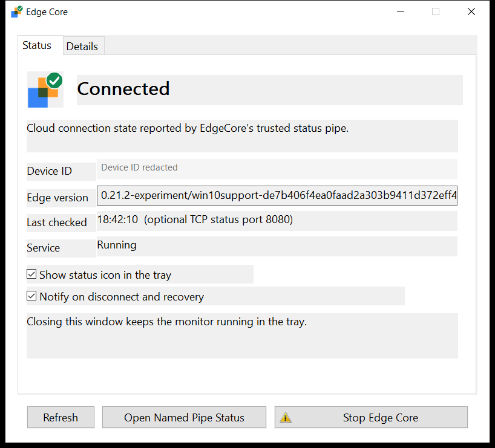
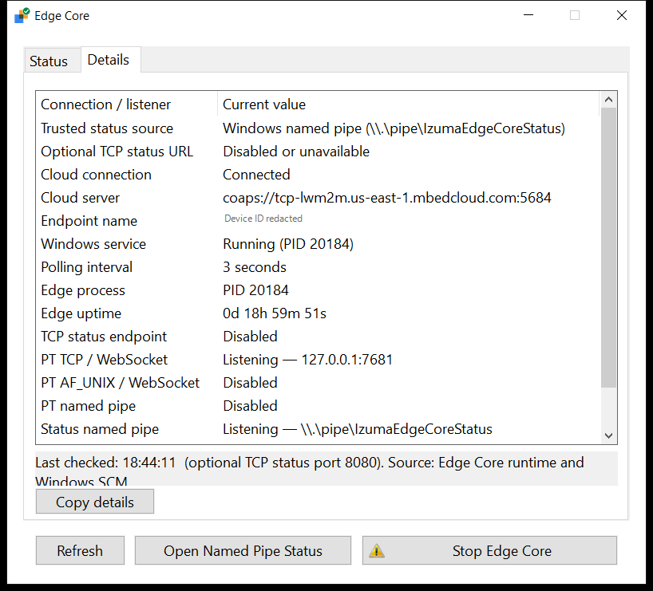
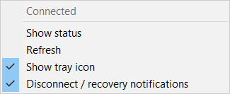

# Windows service guide

This guide covers installing and operating mbed-edge (Edge Core) as the native
Windows service **EdgeCore**, with or without a desktop. It describes the current
Izuma Edge setup EXE, the offline core package, the Edge Core Monitor, and
headless service management.

## Components and requirements

| Component | Purpose | Requires a desktop? |
| --- | --- | --- |
| `edge-core.exe` / `EdgeCore` service | Runs Edge Core and maintains its cloud connection and device identity. | No |
| `edge-core-monitor.exe` | Displays service and cloud status in a window and the Windows notification area (tray). | Yes, in a signed-in user's session |
| `izuma-edge-ctl.exe` | Provides `start`, `stop`, `status`, and JSON status commands. | No |

The monitor and command-line helper are separate programs. Closing or exiting
the monitor does not stop Edge Core. The service continues running when users
sign out. The helper's full command name is **`izuma-edge-ctl`**.

Use an x64 Windows machine and an administrator account or a deployment job
running as SYSTEM. Installation scripts require **64-bit Windows PowerShell
5.1**. The offline installer includes the required Microsoft Visual C++ x64
runtime and application dependencies; the target needs no compiler, Python,
source checkout, or installation-time download. Cloud bootstrap and registration
require outbound connectivity to the configured cloud service.

The current implementation and installation tests have been qualified on
Windows 10 Pro x64. Windows 11 and Windows Server editions, including Server
Core, require their own qualification. The service and CLI are designed for
headless operation; the tray monitor requires an interactive desktop.

The current combined installer is an **Inno Setup EXE**. MSI delivery is not yet
implemented; use the EXE switches below rather than `msiexec` properties. Use
your approved release artifact and deployment trust policy. Unsigned packages
used during qualification are not signed production releases.

## Windows and Linux differences

| Area | Windows | Linux |
| --- | --- | --- |
| Process management | Native Windows Service Control Manager (SCM) service named `EdgeCore`. Console operation is also available for development. | Existing console operation or the service manager configured by your Linux deployment. This guide does not define a Linux service unit. |
| Service identity | Restricted `NT AUTHORITY\LocalService` token with a dedicated, restricted service SID. | User and filesystem permissions selected by the Linux deployment. |
| Local status | `\\.\pipe\IzumaEdgeCoreStatus` by default. TCP HTTP status is **off by default**. | Existing HTTP `GET /status` behavior remains unchanged: default bind `127.0.0.1`, default port `8080`. |
| Default PT connection | Loopback TCP/WebSocket at `127.0.0.1:7681`; optional Windows AF_UNIX and PT named-pipe transports can be configured. | Existing Unix-domain PT socket, default `/tmp/edge.sock`. |
| Desktop monitoring | Optional native Windows monitor and tray icon. | No Linux GUI adapter is supplied by the current monitor repository. |
| Headless control | `izuma-edge-ctl`, PowerShell service commands, or `sc.exe`. | Existing deployment-specific commands; the Windows CLI does not manage Linux services. |
| Persistent data | Installer-managed private directories under `%ProgramData%\Izuma\EdgeCore`. | Existing PAL storage configuration; a normal console run uses its existing working-directory storage. |

The Windows status pipe is separate from any named pipe used by protocol
translators. Disabling **TCP status** does not disable the PT TCP listener on
port `7681`. These Windows defaults do not change Linux's HTTP status endpoint,
Unix socket, or provisioning behavior. See [local status](local-status.md) and
[Windows PT transports](windows-pt-transports.md) for the detailed contracts.

## Default installation locations

| Item | Default location |
| --- | --- |
| Versioned core binaries | `%ProgramFiles%\Izuma\EdgeCore\releases\<version>` |
| Provisioning and runtime configuration | `%ProgramData%\Izuma\EdgeCore\config` |
| Persistent device identity and state | `%ProgramData%\Izuma\EdgeCore\state` |
| Service log | `%ProgramData%\Izuma\EdgeCore\logs\edge-core.log` |
| Setup and maintenance scripts | `%ProgramFiles%\Izuma\EdgeSetup\scripts` |
| Versioned monitor executable | `%ProgramFiles%\Izuma\EdgeSetup\monitor\<version>\edge-core-monitor.exe` |
| Versioned command-line helper | `%ProgramFiles%\Izuma\EdgeSetup\ctl\<version>\izuma-edge-ctl.exe` |
| Combined deployment metadata | `%ProgramFiles%\Izuma\EdgeSetup\deployment.json` |
| Per-user monitor preferences | `%LOCALAPPDATA%\Izuma\EdgeCoreMonitor\settings.ini` |

The service can modify its state and logs but cannot replace its installed
binaries. Private configuration and identity are accessible to the service's
restricted SID, administrators, and SYSTEM. Ordinary monitoring does not
require reading those private directories.

## Install with the current setup EXE

### Desktop installation

1. Obtain the approved `izuma-edge-X.Y.Z-windows-x64.exe` installer and, when
   needed, a separate provisioning bundle for this machine. Replace `X.Y.Z` in
   this guide's examples with the version you received.
2. Run the installer and approve Windows administrator elevation.
3. Select **Edge Core with tray monitor**, or **Edge Core service only**. The
   monitor is optional and selected by default. The service and command-line
   helper are required components.
4. On **Device identity**, select developer credentials, production credentials,
   or **Retain existing identity, or provision later**. For file provisioning,
   supply the machine's CBOR or JSON bundle. Keep JSON DER sidecars beside the
   JSON file until import.
5. On **Service and monitor options**, choose whether the monitor starts at user
   sign-in and whether local interactive users may start/stop the service.
   Administrator-only service control is the default. Choose whether to start
   Edge Core after installation when provisioning or retained state is present.
6. Complete installation. Open **Edge Core** from the Start menu to show the
   monitor; when sign-in startup is enabled, it also starts under each user's
   normal account at their next sign-in.

Setup does not launch the GUI as administrator or in the service's session.
Existing per-user tray and notification preferences are preserved.

### Silent or headless installation

Run from an **Administrator PowerShell** terminal or a SYSTEM deployment job.
Create the log directory first. This software-only example installs the service
and CLI, omits the monitor, and leaves the unprovisioned service stopped:

```powershell
$setup = Start-Process -FilePath 'D:\packages\izuma-edge-X.Y.Z-windows-x64.exe' `
    -ArgumentList '/VERYSILENT /SUPPRESSMSGBOXES /NORESTART /INSTALLMONITOR=0 /STARTSERVICE=0 /LOG="D:\logs\izuma-edge-setup.log"' `
    -WindowStyle Hidden -Wait -PassThru
$setup.ExitCode
```

To provision and start a headless machine during installation:

```powershell
$setup = Start-Process -FilePath 'D:\packages\izuma-edge-X.Y.Z-windows-x64.exe' `
    -ArgumentList '/VERYSILENT /SUPPRESSMSGBOXES /NORESTART /INSTALLMONITOR=0 /PROVISIONINGMODE=production /PROVISIONING="D:\factory\device.cbor" /STARTSERVICE=1' `
    -WindowStyle Hidden -Wait -PassThru
$setup.ExitCode
```

`Start-Process -Wait` lets automation wait for setup and inspect its exit code.
Silent operation requires an already elevated token; these switches do not
suppress Windows UAC. Standard switches are documented by
[Inno Setup](https://jrsoftware.org/ishelp/topic_setupcmdline.htm).

| Switch | Fresh-install default | Meaning |
| --- | --- | --- |
| `/INSTALLMONITOR=0` or `1` | `1` | Omit or install the desktop monitor. The CLI is installed in both cases. |
| `/MONITORSTARTUP=0` or `1` | `1` | Start the installed monitor at user sign-in. |
| `/MONITORUSERCONTROL=0` or `1` | `0` | Keep administrator-only control, or explicitly grant local interactive users Start/Stop when the monitor is installed. |
| `/STARTSERVICE=0` or `1` | `0`; `1` when a provisioning file is supplied | Start after fresh installation. An ordinary upgrade preserves running/stopped state. |
| `/PROVISIONING=<absolute file>` | None | Supply external `.cbor` or `.json` input on a fresh installation. Not accepted during an upgrade. |
| `/PROVISIONINGMODE=auto`, `developer`, `production`, or `deferred` | `auto` | Auto selects developer for file input, otherwise deferred. Select production explicitly for a production file. |
| `/LOG=<file>` | No explicit log path | Write setup diagnostics to an existing directory. |

Setup never restarts Windows itself. Exit `0` means success; `3010` means the
bundled prerequisite requested a restart. Schedule that restart through your
deployment system. Other nonzero results indicate failure; inspect the setup
log and `%ProgramFiles%\Izuma\EdgeSetup\deployment.log`.

A fresh installation with no provisioning or retained state uses **manual
startup**. Provisioning enables **delayed automatic startup**. Choosing not to
start a provisioned service immediately does not disable its automatic startup
at the next boot.

### Provision later

For a software-only setup installation, run the installed script from
Administrator PowerShell, then start the service:

```powershell
& 'C:\Program Files\Izuma\EdgeSetup\scripts\provision-service.ps1' `
    -ProvisioningFile 'D:\factory\device.cbor' -ProvisioningMode production
izuma-edge-ctl start
izuma-edge-ctl status
```

Use `-ProvisioningMode developer` for a developer bundle. This is **first
provisioning only**: the service must be stopped and its private state empty.
It refuses an existing provisioning argument, import journal, or retained state.
It does not reset an established identity. The mode records operator intent;
successful staging does not prove successful cloud enrollment.

Use a unique provisioning bundle for each machine. Do not copy an already
provisioned `state` directory into a Windows image. Normal start/stop and upgrades
reuse the stored identity; do not use `--reset-storage` for routine management.

## Install from an offline core package

The separate `edge-core-X.Y.Z-windows-x64` package provides a script-based,
headless installation alternative. Extract it to a dedicated local directory
and invoke `scripts\install-package.ps1` from **64-bit Administrator PowerShell**:

```powershell
$package = 'D:\packages\edge-core-X.Y.Z-windows-x64'
$trustedSigner = 'YOUR_APPROVED_RELEASE_CERTIFICATE_THUMBPRINT'
& "$package\scripts\install-package.ps1" `
    -PackageDirectory $package -SignerThumbprint $trustedSigner `
    -ProvisioningFile 'D:\factory\device.cbor' -ProvisioningMode production -Start
```

Replace `YOUR_APPROVED_RELEASE_CERTIFICATE_THUMBPRINT` with the trusted signer
thumbprint from your deployment policy. Qualification
packages can use the explicit `-AllowUnsigned` option instead; authenticate their
content separately before running an elevated script. The package contains the
offline prerequisite and runtime dependencies. Omit `-Start` to leave it stopped;
omit provisioning for a software-only installation.

**The raw core package does not install the monitor or `izuma-edge-ctl`.** Use
the combined setup EXE, including its `/INSTALLMONITOR=0` mode, when you want the
CLI installed by default. PowerShell and `sc.exe` management work with either
installation method. The lower-level `install-service.ps1` registers a service
from an already staged binary directory; it is intended for development and
controlled administrative workflows, not a replacement for package deployment.

## Edge Core Monitor and tray

### Open the monitor and read status

Open **Edge Core** from the Start menu, click its tray icon, or choose **Show
status** from the tray menu. If Windows hides the icon, expand the notification
area's hidden icons. The monitor polls every three seconds and checks service
state independently through SCM.

The **Status** tab shows cloud connection state, device ID, Edge version, last
check time, and service state. **Refresh** requests another check. **Start Edge
Core** or **Stop Edge Core** controls the service when permitted; Stop asks for
confirmation. An administrator may receive UAC for the short-lived control
helper while the monitor itself stays unelevated.



*Status view on Windows. The device identifier is redacted.*

| Tray/status indication | Meaning |
| --- | --- |
| Green / Connected | Edge Core reports an active cloud connection. |
| Amber / Connecting | Cloud connection is in progress. |
| Red / Error or invalid response | A cloud error or invalid status response was reported. Read the status text. |
| Gray / Checking or unavailable | Status is being checked or the local endpoint is unavailable. Check the service row. |

**Running is not the same as Connected.** SCM reports Running once the local
service is ready; cloud connection proceeds asynchronously. A connected label
reports Edge Core's own connection state, not an independent cloud resource
read or a guarantee that every protocol translator is operating.

### Details and named-pipe status

The **Details** tab shows the trusted status source, optional TCP status endpoint,
cloud server, process ID and uptime, active listener addresses, registered PT and
device counts, and pipe capacity/access information. Disabled transports are
distinguished from listening transports. **Copy details** copies the displayed
values.



*Details view showing named-pipe status with TCP status disabled. The endpoint
identifier is redacted.*

**Open Named Pipe Status** appears when the user's account can read the status
pipe and its server/response process IDs match the running service. It opens a
fresh, formatted, read-only JSON snapshot with **Copy JSON**. Reopen it to obtain
a new snapshot. If both TCP and the pipe are accessible, the pipe button wins.

**Open TCP Status** is offered only when the pipe is unavailable or unreadable
and an accessible loopback TCP status listener is verified as belonging to
EdgeCore. It opens the status URL in a browser. If neither is accessible, the
button is disabled. TCP-only access does not supply the monitor's trusted cloud
connection label. Status snapshots can contain a device identifier; obscure it
before publishing screenshots or support material.

### Tray, notifications, and closing the window

Right-click the tray icon for **Show status**, **Refresh**, **Show tray icon**, and
**Disconnect / recovery notifications**. Tray visibility and notifications are
independent preferences. After its first connected baseline, the monitor requests
one notification on disconnect and one on recovery; repeated failing checks do
not create repeated disconnect notifications. Windows notification settings can
suppress visible delivery.



*The monitor's tray menu. Closing the status window keeps this monitor running.*

Clicking **X hides the window and keeps the monitor running**. Click the tray
icon, choose Show status, or reopen the Start menu shortcut to return. Closing
the window while the tray is disabled enables the tray for that session without
changing the saved preference. If Windows cannot add the tray icon, the window
remains accessible.

There is no Exit command in the tray menu. For deliberate monitor shutdown in
the current desktop session, use its `--exit` option. With a combined setup
installation, Administrator or ordinary PowerShell can locate the executable
from deployment metadata:

```powershell
$deployment = Get-Content 'C:\Program Files\Izuma\EdgeSetup\deployment.json' -Raw | ConvertFrom-Json
if ($deployment.monitorExecutable) { & $deployment.monitorExecutable --exit }
```

This exits the monitor, not the EdgeCore service. The monitor is unnecessary on
a headless machine and does not run in the Windows service's session.

## Headless management

### Using `izuma-edge-ctl`

The combined installer always installs the CLI and adds its protected directory
to machine PATH. Open a new terminal after setup. Use these commands in either
**Command Prompt or PowerShell**; run Start/Stop from an administrator terminal
or SYSTEM job unless an explicit service-control grant applies:

```console
izuma-edge-ctl start
izuma-edge-ctl stop
izuma-edge-ctl status
izuma-edge-ctl status --json
izuma-edge-ctl --help
```

Start/Stop wait up to 30 seconds for the requested SCM state. Repeating a completed
Start or Stop succeeds. They preserve service arguments, startup configuration,
provisioning and identity, and never open a confirmation dialog or UAC prompt.
The helper controls the fixed local service `EdgeCore`; it has no remote-service
or alternate-service-name option.

Status reports service state, process ID, cloud state, version, and status source.
It uses the verified named pipe and does not fall back to HTTP or display the
private device identity. JSON output is one UTF-8 object, suitable for automation:

```powershell
$text = izuma-edge-ctl status --json
$exitCode = $LASTEXITCODE
$status = $text | ConvertFrom-Json
$status | Select-Object serviceState, cloudState, statusAvailable, processId
# Inspect $exitCode as well as $status.cloudState in your deployment logic.
```

| Exit code | Meaning |
| --- | --- |
| `0` | Control reached the requested state, or a status report succeeded. Stopped and valid connecting/cloud-error reports also return zero. |
| `2` | Missing/invalid command or unsupported arguments. |
| `5` | Access denied; use the permitted service-control account. |
| `21` | Service is Running, but trusted named-pipe status is unavailable. |
| `1060` | Service is not installed. |
| `1460` | Service-control wait timed out. Windows may still complete the request; check status again. |
| Other nonzero | Windows service/system error. |

Help and usage errors include the footer `(c) Izuma Networks Inc. 2026`.
Existing shells and long-lived management agents keep their old environment.
If the command is not found after installation, open a new terminal or use the
installed absolute path from PowerShell:

```powershell
$deployment = Get-Content 'C:\Program Files\Izuma\EdgeSetup\deployment.json' -Raw | ConvertFrom-Json
& $deployment.ctlExecutable status --json
```

### Using PowerShell

These native service commands remain available. Use **Administrator PowerShell**
for control under the default policy:

```powershell
Start-Service -Name EdgeCore
Stop-Service -Name EdgeCore
Get-Service -Name EdgeCore | Select-Object Name, Status, StartType
```

For process ID, configured command line, startup mode, and service account:

```powershell
Get-CimInstance Win32_Service -Filter "Name='EdgeCore'" |
    Select-Object Name, State, ProcessId, StartMode, StartName, PathName
```

These commands query SCM, not cloud connectivity. To read verified pipe/cloud
status with the installed helper scripts while the service is Running:

```powershell
. 'C:\Program Files\Izuma\EdgeSetup\scripts\package-tools.ps1'
$cloud = Read-EdgeStatus -ServiceName EdgeCore
[pscustomobject]@{
    CloudState = $cloud.status
    ProcessId = $cloud.connectivity.processId
    Version = $cloud.'edge-version'
}
```

For a raw core package installation, dot-source `scripts\package-tools.ps1` from
the extracted package instead. This helper implements the pipe's framing,
timeouts, and service/process checks. The pipe is not an HTTP URL and cannot be
opened with `Invoke-RestMethod`.

If you are at a **Command Prompt** such as `C:\Users\name>`, PowerShell's `&`
invocation syntax and single-quoted paths do not work there. Invoke a script
through PowerShell instead:

```cmd
powershell.exe -NoProfile -File "D:\packages\edge-core-X.Y.Z-windows-x64\scripts\install-package.ps1" -PackageDirectory "D:\packages\edge-core-X.Y.Z-windows-x64" -SignerThumbprint "YOUR_APPROVED_RELEASE_CERTIFICATE_THUMBPRINT"
```

Use an elevated terminal for installation. Follow your script-signing/execution
policy; `-ExecutionPolicy Bypass` is not administrator elevation or publisher
verification.

### Using `sc.exe`

These commands work in both Command Prompt and PowerShell:

```console
sc.exe start EdgeCore
sc.exe stop EdgeCore
sc.exe query EdgeCore
sc.exe queryex EdgeCore
```

Use `sc.exe` explicitly in PowerShell because `sc` can resolve to a PowerShell
alias. SC commands report SCM state and do not wait for a cloud connection.
Start/Stop can initially report a pending state; query again for completion.
See Microsoft's [SC query reference](https://learn.microsoft.com/en-us/windows-server/administration/windows-commands/sc-query).

### Permissions and optional TCP status

By default, administrators and SYSTEM control the service. Ordinary local
interactive users can read status. The setup option `/MONITORUSERCONTROL=1`
explicitly grants interactive local users Start/Stop when the monitor is
installed; it updates both the protected machine policy and SCM permissions.
Deselecting the monitor revokes that grant. Per-user preferences do not grant
service-control rights.

Keep TCP status disabled when the named pipe meets your needs. For a **new
script-based core package installation**, `install-package.ps1 -EnableTcpStatus`
opts in by writing protected runtime configuration. On an existing service, the
equivalent setting must be merged into its protected JSON configuration selected
by `--config`, then activated by restarting the service:

```json
{
  "status": {
    "tcpEnabled": true
  }
}
```

Preserve other runtime settings and service arguments. `--http-port 8080` alone
does not enable Windows TCP status, and the current setup EXE has no equivalent
TCP-status switch. When explicitly enabled on loopback, the endpoint is
`http://127.0.0.1:8080/status` (or the configured port). Its HTTP response retains
the existing fields, including the full cloud URI, so access differs from the
local pipe's sanitized status response. Linux's default loopback HTTP endpoint
remains unchanged.

## Upgrade, uninstall, and troubleshooting

Run a newer combined setup EXE without `/PROVISIONING` to upgrade. It preserves
identity/state, service arguments, running/stopped state, component selection,
and monitor choices. Downgrades are rejected. The CLI's versioned PATH entry is
updated, and rollback restores the previous entry. Open a new terminal afterward.
For raw core packages, use their administrative `update-service.ps1`; see the
installer repository's [package guide](https://github.com/IzumaNetworks/mbed-edge-windows-installer/blob/main/windows/README.md).

Close monitors in their user sessions before uninstalling. For combined setup,
use **Izuma Edge** in Apps/Programs and Features, or Administrator PowerShell:

```powershell
$uninstall = Start-Process -FilePath 'C:\Program Files\Izuma\EdgeSetup\unins000.exe' `
    -ArgumentList '/VERYSILENT /SUPPRESSMSGBOXES /NORESTART' `
    -WindowStyle Hidden -Wait -PassThru
$uninstall.ExitCode
```

Removal unregisters the service and removes installer-owned monitor/CLI assets,
their machine integration and the CLI PATH entry. Core releases, provisioning,
private state and logs are retained. Per-user monitor preferences are retained.
Uninstallation is not an identity reset.

| Symptom | Check |
| --- | --- |
| `izuma-edge-ctl` is not found | Open a new terminal; inspect `deployment.json` and use `ctlExecutable`. A raw core package does not include the CLI. |
| Start/Stop returns `5` | Use an administrator terminal/SYSTEM job, or check the explicitly configured user-control policy and SCM rights. |
| Service is Running but not Connected | Check named-pipe cloud status, provisioning, outbound connectivity, and the service log. Running describes local readiness. |
| Status returns `21` | Check that the pipe is available to this account and belongs to the current service. Do not enable TCP solely to hide a failed trusted-pipe read. |
| Service is missing (`1060`) | Check setup/deployment logs and whether the installation completed. |
| No tray icon | Confirm the monitor component is installed and running in this signed-in session; expand hidden icons. A headless session has no tray. |
| X does not stop Edge Core | Expected: X hides the monitor window. Use `izuma-edge-ctl stop` or `Stop-Service EdgeCore` to stop the service. |
| Logs/private state return Access denied | Inspect these directories from an administrator terminal; ordinary users do not have private-data access. |

To follow service diagnostics from Administrator PowerShell:

```powershell
Get-Content 'C:\ProgramData\Izuma\EdgeCore\logs\edge-core.log' -Tail 100 -Wait
```

For source builds, service internals, and qualification details, see
[Windows build and service implementation](windows-build.md). For packaging,
component switches and provisioning, see the installer repository's
[setup guide](https://github.com/IzumaNetworks/mbed-edge-windows-installer/blob/main/windows/installer/README.md).
